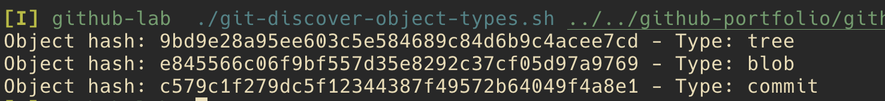
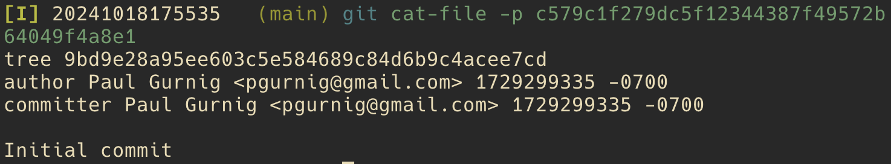

<div style="text-align: center;">
  
</div>

*This is part of a series.*

# .git Database: Hard Reset ~1
This repository demonstrates how the .git database changes over time as you make commits, modify files, and then use `git reset --hard` to revert changes. It provides a step-by-step illustration to help users understand the effects of `git reset --hard` on the Working Tree, Staging Area and Object Database given an "initial commit", file changes, a second commit, then a reset.

For simplicity, we're assuming a single branch, `main`.

## Level Set
Git tracks changes in a hidden directory, `.git` - this is sometimes referred to as the **Object Database**. The contents of files (blobs), directories (trees) are stored in .git/objects. (That directory also stores commits and tags.) `.git/objects` (and other files/directories in `.git`) tracks changes over time.

 Changes appear in various states that consist of:
   - Working Tree or Working Directory (this paper favors *Working Tree*)
   - Staging Area or Index (this paper favors *Staging Area*)
   - Object Database, HEAD or local repo (this paper favors the term *Object Database*)
   - Remote as it refers to the remote repository (i.e., GitHub, GitLab, BitBucket, CodeCommit)

| Working Tree   | Staging Area (Index) | Object Database (HEAD) | Remote Repo |
|:--------------:|:--------------------:|:-----------------:|:-----------:|
|       ✓        |        ✓             |         ✓         |         ✓   |

The initial .git directory looks like this.


The *directories* that change in the `.git` folder (or are added) are:
```
- logs
- objects
- refs
```
The *files* that change in the `.git` folder (or are added) are:
```
- COMMIT_EDITMSG
- config
- index
- ORIG-HEAD
```
Given that, our analysis won't be concerned with:
```
- hooks (directory)
- info (directory)
- description (file)
- HEAD (file)
```
## Summary

## Detail
Each section will contain a brief analysis of the changes to both `.git` and the working tree.
#### Understanding `git init`
The initial `.git` directory looks like this.


Rather than discuss what each of these elements are, we'll discuss them in the context of changes over time.

#### Change #1 to the working tree `echo "README" > "README.md"`
Creating a new `README.md` file has no impact on `.git`.


#### Understanding `git add README.md`
This is a fairly important stage in the process, and one that some git "helper" tools gloss over.

Executing `git add README.md` impacts two items.
- An object is added to the `objects` subdirectory, e845566c06f9bf557d35e8292c37cf05d97a9769. This blob is the SHA-1 hash of metadata and the file contents.
- The `index` file is added. This file is tracking the changes you're introducing for a future commit.

> 📝 **Note**
> *We'll see this same object (e845566c06f9bf557d35e8292c37cf05d97a9769) in other repos in this series as the contents and metadata are the same.*


##### The e8 object
The object, `e845566c06f9bf557d35e8292c37cf05d97a9769`, is the result of applying SHA-1 to the README.md file. You can garner the same has value by using `git hash-object` on the file to understand how the hash is created. (There's a bit more to `git hash-object` than simply calculating the hash using `shasum` as it leverages metadata for its computation, specifically, `blob <size>\0<content>`.)


Note that Git uses the first two characters of the hash as the subdirectory to allow for more even distribution of folders. There are 256 possible combinations of the first two characters. (The math: each of the two characters can be a value 0-9, a-f, or a hex value. There are 16 values possible for each, so 16*16.)

##### The `index` file
The `index` file makes an appearance! This is an indication that we're introducing changes in our *Staging Area*. These changes are not yet committed. Think of the staging area as a place to jot down the files you are planning to commit. You can add files one at a time to organize your commit at a granular level (rather than just invoking `git add .` from the root folder in the project).

You can't `cat` the `.git/index` file obtaining any sensible results. However, you can run the following to understand the contents:

```bash
git ls-files --stage
```
So, we have our blob (`.git/objects` and an indication of what we want to commit `index`). Let's go ahead and commit these changes.

#### Understanding `git commit -m "Initial commit"`
With `git commit`, we see even more changes to the Object Database.


- Our `e8` object remains intact, but we have two new objects beginning with `9b` and `c5`.
- `refs/heads` now has a file `main`.
- There's a new file, `COMMIT_EDITMSG`.
- The `index` file that was introduced in the prior step (`git add <filename>`) has changed.
- There's a new `logs` directory with several additions.

Let's look at each of these in turn.

##### `.git/objects` changes
Two new objects appear in the objects folder:
```bash
- 9bd9e28a95ee603c5e584689c84d6b9c4acee7cd
- c579c1f279dc5f12344387f49572b64049f4a8e1
```

We've covered the blob above, so won't consider that now.

We can use a shell utility, `git-discover-object-types.sh`, to iterate over the objects and discover their types. (*The shell script, `git-discover-object-types.sh`, is available in this repo: https://github.com/pgurnig/github-lab.*)



We have two new types: a tree and a commit. Let's review each.

###### The tree object - new object
When we `git cat-file -p <hash>` on the tree, the output shows a reference to the prior `e84556` hash, which is our `README.md` file.


###### The commit object - new object
When we `git cat-file -p <hash>` on the commit, the output shows the commit message with a reference to the hash of the root tree.



<br />
<small>

> 📝 **Additional Info**
> Beyond the scope of this topic, but interesting to understand is reverse engineering the name of the tree. In the example above, `git cat-file -p` on the hash of the tree only shows information about the README blob, not the directory name associated to the tree. <br /><br />
> The following screenshot shows how we can arrive at the name of the directory by first getting the hash of the root tree, then plugging that into `git ls-tree`. Note that the example below is based on a different repo!<br /><br />
> 

</small>

##### The new `logs/refs/heads/main` file
If we `cat` the contents of the file, we see something like this:
```
0000000000000000000000000000000000000000 c579c1f279dc5f12344387f49572b64049f4a8e1 J Doe <jdoe@example.com> 1729299335 -0700      commit (initial): Initial commit
```

Let's break down the elements:
- `0000000000000000000000000000000000000000`: This is the previous commit. All zeroes means that there was no previous commit.
- `c579c1f279dc5f12344387f49572b64049f4a8e1`: This commit, as we saw above.
- `J Doe <jdoe@example.com>`: The name of the committer.
- `1729299335`: The UNIX timestamp.
- `commit (initial): Initial commit`: The initial commit message.


##### Introducing `COMMIT_EDITMSG`
lorem

##### `index` changes
lorem

##### The `logs` directory
lorem


#### Change #2 to the working tree `echo "Lorem ipsum" > "example.txt"`
#### Understanding `git add example.txt`
#### Understanding `git commit -m "Add example.txt"`
#### Understanding `git reset --hard HEAD~1`
