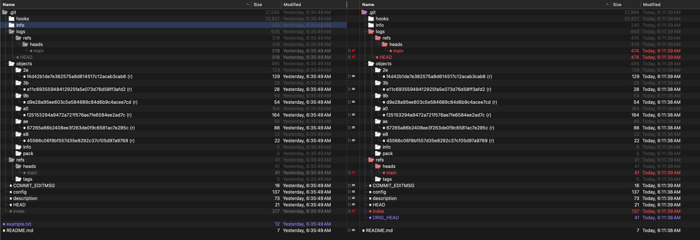
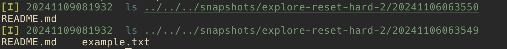

<div style="text-align: center;">
  
</div>

# .git Database: Hard Reset ~1
This article explores how the .git database evolves through key Git operations: initializing a repository, adding files, committing changes, adding new untracked content, committing again, and finally using `git reset --hard` to revert to the original commit. A step-by-step guide demonstrates the effects of `git reset --hard` on the *Working Tree*, *Staging Area*, and *Object Database*.”
<small>
> If the terms *Working Tree*, *Staging Area*, or *Object Database* are not familiar, review this [brief guide](level-set.md) that explains these concepts.
</small>

**Table of Contents**<br/>
[Our Steps](#our-steps)<br/>
[Step-by-Step](#step-by-step)<br/>
[Summary](#summary)<br/>
[The Analysis](#the-analysis)<br/>
&nbsp;&nbsp;&nbsp;&nbsp;*[Understanding git reset --hard HEAD~1](#understanding-git-reset---hard-head1)*<br/>
&nbsp;&nbsp;&nbsp;&nbsp;*[Observed Changes](#observed-changes)*<br/>
&nbsp;&nbsp;&nbsp;&nbsp;&nbsp;&nbsp;&nbsp;&nbsp;*[The Object Database](#the-object-database)*<br/>
&nbsp;&nbsp;&nbsp;&nbsp;&nbsp;&nbsp;&nbsp;&nbsp;*[Index Comparison](#index-comparison)*<br/>
&nbsp;&nbsp;&nbsp;&nbsp;&nbsp;&nbsp;&nbsp;&nbsp;*[The Working Tree](#the-working-tree)*<br/>
&nbsp;&nbsp;&nbsp;&nbsp;&nbsp;&nbsp;&nbsp;&nbsp;*[Additional Observations](#additional-observations)*<br/>
&nbsp;&nbsp;&nbsp;&nbsp;*[Undoing the Reset](#undoing-the-reset)*<br/>
[Types of Resets](#types-of-resets)<br/>
[License](#license)

## Our Steps
- Working Tree Modifications (create a simple README.md file)
- Update the Staging Area (`git add README.md`)
- Commit #1 (`git commit -m "Initial commit"`)
- Working Tree Modifications
- Update the Staging Area (`git add example.txt`)
- Commit #2 (`git commit -m "Add example.txt"`)
- Reset back to Commit #1 (`git reset --hard HEAD~1`)

## Step-by-Step
> To see the change detail from `git init` through Commit #2, refer to [this](object-database-init-to-commit-2.md).

## Summary
The intent of git reset --hard HEAD~1 is to set the user back to the previous commit—this includes the *Working Tree*, *Staging Area*, and *Object Database* (HEAD). While changes to the *Working Tree* are reset to match the previous commit, the *Object Database* retains history, including objects created after the first commit. This behavior offers insights into both the mechanics of `reset` and Git’s design philosophy.

This behavior retains object history, reflecting Git’s design to support the recovery of prior states, even after a reset.

## The Analysis
### Understanding `git reset --hard HEAD~1`

To understand the impact of `git reset --hard HEAD~1`, we first examine the states of the *Working Tree*, *Staging Area*, and *Object Database* at key points: specifically, after `git commit -m "Initial commit"`, `git commit -m "Add example.txt"` and then `git reset --hard HEAD~1``.

We won’t just compare commit hashes but we'll delve into the .git database, focusing on changes to the *Object Database*, `index`, and *Working Tree* between specific steps.

### Observed Changes

#### The Object Database
After executing `git reset --hard HEAD~1`, the contents of `.git/objects` remain unchanged from `git commit -m "Add example.txt"`, retaining all commits, trees, and blob objects, even from reverted commits:


Just from a listing of the objects, one can take note of two commits and two blobs. The first commit obviously simply contained one commit and one file, README.md.
```bash
Object hash: 2ef4d42b1de7e382575a8d614517c12acab3cab6 - Type: commit
Object hash: 3be11c69355948412925fa5e073d76d58ff3afd2 - Type: blob
Object hash: 9bd9e28a95ee603c5e584689c84d6b9c4acee7cd - Type: tree
Object hash: a0f25153294a9472a721f576ae7fe6584ee2ad7c - Type: commit
Object hash: ae67265a86b2408ee3f263de0f9c6581ac7e295c - Type: tree
Object hash: e845566c06f9bf557d35e8292c37cf05d97a9769 - Type: blob
```

This may be somewhat surprising given warnings often associated with the "hard" flavor of `git reset`. The database preserves `example.txt` and its associated commit and tree objects, even though the *Working Tree* and `index` reflect only `README.md`. This illustrates that `git reset` modifies the *Working Tree* and `index`, but leaves much of the *Object Database* intact.

#### Index Comparison
Now that we've inspected both the *Object Database*, let's consider the *Staging Area* or `index`.

Comparing the `index` file after the reset reveals it has reverted to the state of `git commit -m "Initial commit"`. We can use `git ls-files --stage` to inspect the contents of the `index` - this will detail a number of properties for us including permissions, that hash and the path. The following differences highlight this:

`git ls-files --stage` after the second staging.<br/>
<br/>

`git ls-files --stage` after the reset.<br/>


#### The Working Tree
With the *Object Database* and *Staging Area* accounted for, let's review the *Working Tree*.

Running `ls` on the *Working Tree* illustrates the changes to the file system itself:<br/>


This accounts for the three areas we've been focusing on: the *Working Tree*, *Staging Area* (`index`), and the *Object Database*.

Let's look at some additional items the *Object Database*.

#### Additional Observations
We saw in the *Object Database* comparison above that a number of other items changed:
- `logs/refs/heads/main`
- `logs/HEAD`
- `refs/heads/main`
- `index`
- `ORIG_HEAD`

We've discussed `index`. Let's look at the others.

##### Commit History `logs/refs/heads/main`
Viewing the file, `logs/refs/heads/main`, shows the progression of the commits as:
- No commit (000000) → Initial commit (2ef4d4)
- Initial commit (2ef4d4) → Second commit (a0f251)
- Second commit (a0f251) → Reset back to Initial commit (2ef4d4)

This confirms the reset moved `HEAD` back to the initial commit while preserving our second commit.


We have a few more items.

##### Untracked Files
> The file `COMMIT_EDITMSG` remains unchanged because it is not tracked by Git and thus unaffected by the reset.

##### ORIG_HEAD
> The file `ORIG_HEAD` stores the commit hash (`a0f251`) of the pre-reset state, allowing easy reference to the previous `HEAD` position. We could use this with `git reset --hard ORIG_HEAD`.

##### Blob Object
> Even after resetting, the blob for example.txt (`3be11c`) remains in the database. Note:

`git cat-file -p 3be11c69355948412925fa5e073d76d58ff3afd2`

*yields*

`Lorem ipsum`

### Undoing the reset
In fact, we could then simply issue the following command to continue undo the reset:

```bash
git reset --hard ORIG_HEAD
```

## Types of Resets
`git reset --hard` is one type of reset among three: `--hard`, `--mixed` and `--soft`. Each of these affects the *Working Tree*, *Staging Area* and *HEAD* in different ways, as we'll see below.

`git reset --hard HEAD~n` impacts all three areas. It reverts everything back to the commit specified by *n*. What's interesting is that the *Object Database* may still retain references committed after *n*, but HEAD will move *n* commits back. Think of this as starting over cleanly from the last commit where you want to start cleanly everywhere, including your local files.

| Moves HEAD | Reverts Staging | Reverts Working |
|:----------:|:---------------:|:---------------:|
|     Y      |       Y         |       Y         |

`git reset --mixed HEAD~n` impacts two areas, clearing your *Staging Area* and moving HEAD while leaving your *Working Tree* intact. In the case of `mixed`, your local files remain intact while your *Staging Area* and HEAD revert to the *n* state allowing you to redo the *index* and commit.

| Moves HEAD | Reverts Staging | Reverts Working |
|:----------:|:---------------:|:---------------:|
|     Y      |       Y         |       N         |

`git reset --soft HEAD~n` impacts only HEAD leaving your *Working Tree* and *Staging Area* intact. You might use this to further refine the *Staging Area* and *Working Tree* for a particular commit.

| Moves HEAD | Reverts Staging | Reverts Working |
|:----------:|:---------------:|:---------------:|
|     Y      |       N         |       N         |

## License
This project is licensed under a custom non-commerical license. See the [LICENSE](LICENSE) file for details.

