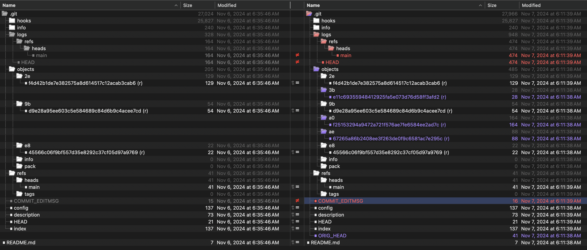

<div style="text-align: center;">
  
</div>

# .git Database: Hard Reset ~1
This article demonstrates how the .git database changes over time as one follows a progression of initializing git, adding, committing, adding new content, committing that content, then using `git reset --hard` to revert to the original commit. We'll provide a step-by-step guide to illustrate the impact of `git reset --hard` on the *Working Tree*, *Staging Area* and *Object Database*.

**Table of Contents**

	•	[Our Steps](#our-steps)
	•	[Step-by-Step](#step-by-step)
	•	[Summary](#summary)
	•	[Types of Resets](#types-of-resets)
	•	[License](#license)

## Our Steps
- Working Tree Modifications
- Update the Staging Area (`git add README.md`)
- Commit #1 (`git commit -m "Initial commit"`)
- Working Tree Modifications
- Update the Staging Area (`git add example.txt`)
- Commit #2 (`git commit -m "Add example.txt"`)
- Reset back to Commit #1 (`git reset --hard HEAD~1`)

## Step-by-Step
> To see the change detail from `git init` through Commit #2, refer to [this](level-set.md).

## Summary
The intent of `git reset --hard HEAD~1` is to revert the user to the previous commit - this includes the *Working Tree*, *Staging Area* and *HEAD*. As we'll see, while changes to the *Working Tree* do absolutely revert, the *Object Database* still keeps track of history including history after the first (initial) commit. What happens to the *Object Database* is interesting and insightful to not only understanding how `reset` works, but also in terms of the thought process behind Git itself.

This behavior preserves the history of objects, ensuring that the underlying Git design supports the recovery of previous states even after a reset.

## The Analysis
## Understanding `git reset --hard HEAD~1`

To grasp the impact of git reset --hard HEAD~1, we must first examine the states of the Working Tree, Staging Area, and Object Database at key points: after git commit -m "Initial commit" and git commit -m "Add example.txt". Following the reset, we’ll compare the initial commit with the reset state and evaluate how .git reflects these changes.

We won’t just compare commit hashes but will delve into the .git database, focusing on changes to the Object Database, index, and .git structure between specific steps.

### Observed Changes

	1.	Object Database:
After executing `git reset --hard HEAD~1`, the contents of `.git/objects` remain unchanged, retaining all commits, trees, and blob objects, even from reverted commits:
```bash
Object hash: 2ef4d42b1de7e382575a8d614517c12acab3cab6 - Type: commit
Object hash: 3be11c69355948412925fa5e073d76d58ff3afd2 - Type: blob
Object hash: 9bd9e28a95ee603c5e584689c84d6b9c4acee7cd - Type: tree
Object hash: a0f25153294a9472a721f576ae7fe6584ee2ad7c - Type: commit
Object hash: ae67265a86b2408ee3f263de0f9c6581ac7e295c - Type: tree
Object hash: e845566c06f9bf557d35e8292c37cf05d97a9769 - Type: blob
```
The database preserves `example.txt` and its associated commit and tree objects, even though the *Working Tree* and `index` reflect only `README.md`. This illustrates that git reset modifies the *Working Tree* and `index`, but not the *Object Database*.

	2.	Index Comparison:
Comparing the `index` file after the reset reveals it has reverted to the state of `git commit -m "Initial commit"`. The following differences highlight this:
```bash
git ls-files --stage
```

	3.	Commit History:
The `logs/refs/heads/main` file shows the progression:
	•	No commit (000000) → Initial commit (2ef4d4)
	•	Initial commit (2ef4d4) → Second commit (a0f251)
	•	Second commit (a0f251) → Reset back to Initial commit (2ef4d4)
This confirms the reset moved `HEAD` back to the initial commit while preserving prior history.

Additional Observations

	1.	Untracked Files:
The file `COMMIT_EDITMSG` remains unchanged because it is not tracked by Git and thus unaffected by the reset.

	2.	ORIG_HEAD:
The file `ORIG_HEAD` stores the commit hash (`a0f251`) of the pre-reset state, allowing easy reference to the previous `HEAD` position.

	3.	Blob Object:
Even after resetting, the blob for example.txt (`3be11c`) remains in the database. Note:

git cat-file -p 3be11c69355948412925fa5e073d76d58ff3afd2

Output:

`Lorem ipsum`


Visual Comparisons

	•	Pre- and Post-Reset Object Listings:


	•	Graph of Commit Logs:


	•	Index and Directory Comparison:




In fact, we could then simply issue the following command to continue back here:

```bash
git reset --hard ORIG_HEAD
```

## Types of Resets
`git reset --hard` is one type of reset among three: `--hard`, `--mixed` and `--soft`. Each of these affects the *Working Tree*, *Staging Area* and *HEAD* in different ways, as we'll see below.

`git reset --hard HEAD~n` impacts all three areas. It reverts everything back to the commit specified by *n*. What's interesting is that the *Object Database* may still retain references committed after *n*, but HEAD will move *n* commits back. Think of this as starting over cleanly from the last commit where you want to start cleanly everywhere, including your local files.

| Moves HEAD | Reverts Staging | Reverts Working |
|:----------:|:---------------:|:---------------:|
|     Y      |       Y         |       Y         |

`git reset --mixed HEAD~n` impacts two areas, clearing your *Staging Area* and moving HEAD while leaving your *Working Tree* intact. In the case of `mixed`, your local files remain intact while your *Staging Area* and HEAD revert to the *n* state allowing you to redo the *index* and commit.

| Moves HEAD | Reverts Staging | Reverts Working |
|:----------:|:---------------:|:---------------:|
|     Y      |       Y         |       N         |

`git reset --soft HEAD~n` impacts only HEAD leaving your *Working Tree* and *Staging Area* intact. You might use this to further refine the *Staging Area* and *Working Tree* for a particular commit.

| Moves HEAD | Reverts Staging | Reverts Working |
|:----------:|:---------------:|:---------------:|
|     Y      |       N         |       N         |

## License
This project is licensed under a custom non-commerical license. See the [LICENSE](LICENSE) file for details.

