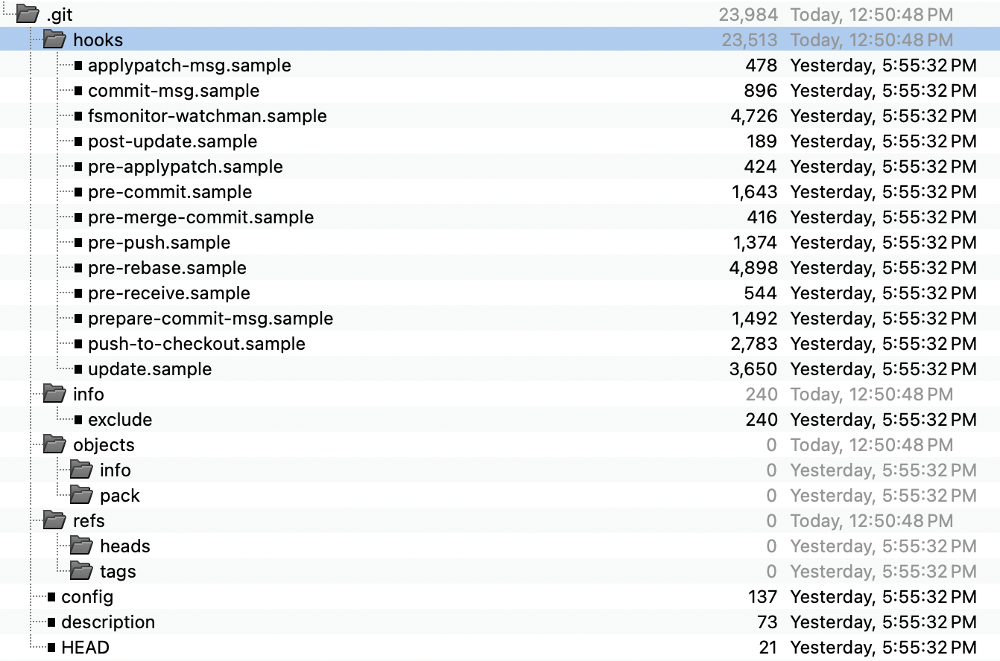

<div style="text-align: center;">
  
</div>

# .git Database: Hard Reset ~1
This repository demonstrates how the .git database changes over time as you make commits, modify files, and then use `git reset --hard` to revert changes. It provides a step-by-step illustration to help users understand the effects of `git reset --hard` on the Working Tree, Staging Area and Local Repo given an "initial commit", file changes, a second commit, then a reset.

## The Steps
- Working Tree Modifications
- `git add .`
- Commit #1
- Working Tree Modifications
- `git add .`
- Commit #2
- `git reset --hard HEAD~1`

## Level Set
Git tracks changes in a hidden directory, .git. The contents of files (blobs), directories (trees) are stored in .git/objects. (That directory also stores commits and tags.) That folder tracks changes over time.

These changes are tracked in various states across the Git Storage Layer that consist of:
   - Working Tree or Working Directory (this paper favors *Working Tree*)
   - Staging Area or Index (this paper favors *Staging Area*)
   - HEAD or local repo (this paper favors the term *Local Repo*)
   - Remote as it refers to the remote repository (i.e., GitHub, GitLab, BitBucket, CodeCommit)

| Working Tree   | Staging Area (Index) | Local Repo (HEAD) | Remote Repo |
|:--------------:|:--------------------:|:-----------------:|:-----------:|
|       ✓        |        ✓             |         ✓         |         ✓   |

The initial .git directory looks like this.



## Summary
`git reset --hard HEAD~1` is thought of as wiping history and a somewhat destructive action. While that's true for the working tree, it's not also true for the .git database. As we'll see by examing the contents of the .git directory over time, while HEAD and the .git/logs/refs/heads/main files point back to the previous commit, `.git/objects` still retains references to the objects introduced in Commit #2. The log history contains a trail of hashes from 000000 to the Commit #1 hash, the Commit #2 hash, then back to the Commit #1 hash.

## The Analysis
The repo begins with a version of this README.md file, then follows these steps:
```
1. git init
2. git add README.md
3. git commit -m "Initial commit"
# add example.txt to the working tree
4. git add example.txt
5. git commit -m "Add example.txt"
6. git reset --hard HEAD~1
```
The goal is to compare `git commit -m "Initial commit"` with `git commit -m "Add example.txt"` to show the differences; then to show the result of `git reset --hard HEAD~1` back to the *initial commit* to understand the impact on the Working Tree, Staging Area and Local Repo.

However, we'll do more than compare the commit hashes, but will examine the .git database in some detail to compare the state of .git between steps 3 and 5, then against 6 and 3.

### Comparing Steps 3 and 5


The image shows newly added files in green, updated files in blue. Let's review.
- example.txt: a new file added to the working tree
- logs: shows the trail of commits on `main`; with `git reset --hard HEAD~1` we'll be back to only line 1 as shown below

#### Logs Diff


### Comparing Steps 5 and 6


#### Logs Diff


What's fascinating with this is that we didn't lose all history. There's still a reference to the `3a23da` commit in the log history.

### Comparing Steps 6 and 3

<!--
20241006111402: the result of `git init`
20241006111450: the result of `git add README.md`
20241006111541: the result of `git commit -m "Initial commit"
20241006111701: the result of adding example.txt to the working tree
20241006111740: the result of `git add example.txt`
20241006111825: the result of `git commit -m "Add example.txt"`
20241006112146: the result of 'git reset --hard HEAD~1`
-->
## The Detail
### Table of Contents
- [Overview](#overview)
- [Getting Started](#getting-started)
- [Workflow](#workflow)
- [Understanding the .git Directory](#understanding-the-git-directory)
- [Observing Changes](#observing-changes)
- [Contributing](#contributing)
- [License](#license)

### Overview
Git is a powerful version control system that tracks changes to files. Sometimes, you may want to revert your working directory to match a previous commit. This can be done using `git reset --hard`, which can alter the Git history and working directory, along with the contents of the `.git` directory.

This repository walks you through an example of how the `.git` directory evolves as changes are made, committed, and then reverted with `git reset --hard`.

One particularly useful comparison for git and especially for being able to experiment freely is illustrated by the concept of git as a "laboratory notebook" of sorts. In the paper

> "Just as experiments are logged in laboratory notebooks, it is important to document the code you use for analysis."
>
> — John D. Blischak, Emily R. Davenport, Greg Wilson, *A Quick Introduction to Version Control with Git and GitHub*

### `git reset` Types
There are three types of resets:
1. **hard**: the type of reset we're exploring here
2. **mixed**: the default type executed when you simply type `git reset`
3. **soft**: `git reset --soft`

These three types may or *may not* impact each of:
Working Directory
Index (Staging Area)
HEAD

For `git reset --hard`, each of these areas is impacted.

| Working Tree  | Index (Staging) |     HEAD     |
|:-------------:|:---------------:|:------------:|
|      ✓        |        ✓        |      ✓       |

### The `reset` areas
A complete explanation of Working Tree, Index (Staging) and HEAD is beyond the scope of this document, but we'll discuss each briefly.

- Working Tree: your local filesystem that may contain committed or uncommitted files
- Index or Staging Area: the area where you stage the files you intend to commit. i.e., the result of `git add <filename>`
- HEAD: a reference to the current commit

### Workflow
The following workflow shows how changes in the `.git` database occur through various operations. You'll be able to track how the Git object database evolves, and how history changes with each step:

1. **init, add and commit**: We create our initial .git state.
   ```bash
   git init
   git add README.md
   git commit -m "Initial commit"
   ```
2. **Examine directory changes**

3. **Make another commit**: Add a new file and commit it.
   ```bash
   echo "Lorem ipsum" >> example.txt
   git add example.txt
   git commit -m "Second commit"
   ```
4. **Examine directory changes**

5. **Perform a hard reset**: Use `git reset --hard` to revert to the first commit.
   ```bash
   git reset --hard HEAD~1
   ```

<!--
3. **Examine the .git directory**: Check the `.git` directory to observe how objects and references change with each commit.
   ```bash
   ls .git/objects
   ```


5. **Re-examine the .git directory**: After the reset, check the `.git` directory again to see how the commit history has been rewritten.
   ```bash
   ls .git/objects
   ```
-->
### Understanding the .git Directory
The `.git` directory is the hidden folder where Git stores all the information about your repository. Some important components:
- **Objects**: Stores the actual file contents, commit objects, trees, and blobs.
- **Refs**: Contains references to commits, such as branches and tags.
- **HEAD**: Points to the current branch and the latest commit.

By exploring the `.git` directory after each operation, you will gain a better understanding of how Git manages your project's history.

### Observing Changes
During the steps above, you can observe the following key changes:
- New **objects** are created each time you make a commit.
- The **HEAD** reference is updated to point to the new commit.
- After `git reset --hard`, the **HEAD** and working directory are rolled back to match the previous state.

These changes allow you to see how Git keeps track of your project's history and how `git reset --hard` alters that history.


## License
This project is licensed under a custom non-commerical license. See the [LICENSE](LICENSE) file for details.

