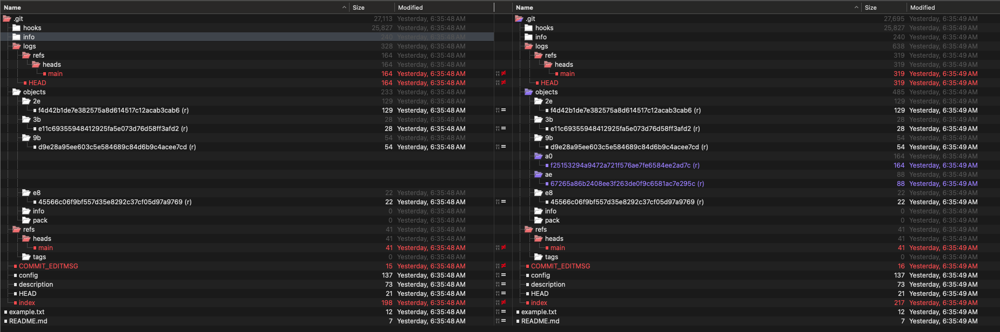

### The Git Object Database across two commits

#### echo "README" > "README.md"
Creating the README.md file incurs no changes on the .git *Object Database*, but does create a change to our *Working Tree*.
<!--  -->
 

#### git add README.md
`git add README.md` adds a folder and file to `.git/objects` and also adds the `index` file.
<!--  -->
 

Using `git cat-file -t`, we can discover the object type for the `e8/45566` folder and file:

Using `git cat-file -p`, we can view the contents:

This blob is the SHA-1 hash of metadata and the file contents.

The `index` file is tracking the changes we're introducing for a future commit.

#### git commit -m "Initial commit"
<!--  -->
 

#### echo "Lorem ipsum" > "example.txt"
<!--  -->
 

#### git add example.txt
<!--  -->
 

#### git commit -m "Add example.txt"
<!--  -->
 