## Detail
Each section will contain a brief analysis of the changes to the *Working Tree*, *Staging Area* and *Object Database* for each step.

### Our Steps
```
git init
echo "README" > "README.md"
git add README.md
git commit -m "Initial commit"
echo "Lorem ipsum" > "example.txt"
git add example.txt
git commit -m "Add example.txt"
git reset --hard HEAD~1
```
<!-- git init: snapshots/explore-reset-hard/20241018175532 -->
<!-- echo "README": snapshots/explore-reset-hard/20241018175533 -->
<!-- git add README.md: snapshots/explore-reset-hard/20241018175534 -->
<!-- git commit -m "Initial commit": snapshots/explore-reset-hard/20241018175535 -->
<!-- echo "Lorem ipsum" > "example.txt": snapshots/explore-reset-hard/20241018175536 -->
<!-- git add example.txt: snapshots/explore-reset-hard/20241018175537 -->
<!-- git commit -m "Add example.txt": snapshots/explore-reset-hard/20241018175538 -->
<!-- git reset --hard HEAD~1: snapshots/explore-reset-hard/20241018175539 -->

<!-- 
The Log: source/repos/github-portfolio/github-lab-snapshots/explore-reset-hard
Friday 2024-10-18 17:55:32

[2024-10-18 17:55:32] explore-reset-hard: git init
[2024-10-18 17:55:32] Initialized
[2024-10-18 17:55:32] Files from  have been copied to snapshots/explore-reset-hard/20241018175532

[2024-10-18 17:55:33] explore-reset-hard: echo "README" > "README.md"
[2024-10-18 17:55:33]
[2024-10-18 17:55:33] Files from  have been copied to snapshots/explore-reset-hard/20241018175533

[2024-10-18 17:55:34] explore-reset-hard: git add README.md
[2024-10-18 17:55:34]
[2024-10-18 17:55:34] Files from  have been copied to snapshots/explore-reset-hard/20241018175534

[2024-10-18 17:55:35] explore-reset-hard: git commit -m "Initial commit"
[2024-10-18 17:55:35] [main
[2024-10-18 17:55:35] Files from  have been copied to snapshots/explore-reset-hard/20241018175535

[2024-10-18 17:55:36] explore-reset-hard: echo "Lorem ipsum" > "example.txt"
[2024-10-18 17:55:36]
[2024-10-18 17:55:36] Files from  have been copied to snapshots/explore-reset-hard/20241018175536

[2024-10-18 17:55:37] explore-reset-hard: git add example.txt
[2024-10-18 17:55:37]
[2024-10-18 17:55:37] Files from  have been copied to snapshots/explore-reset-hard/20241018175537

[2024-10-18 17:55:38] explore-reset-hard: git commit -m "Add example.txt"
[2024-10-18 17:55:38] [main
[2024-10-18 17:55:38] Files from  have been copied to snapshots/explore-reset-hard/20241018175538

[2024-10-18 17:55:39] explore-reset-hard: git reset --hard HEAD~1
[2024-10-18 17:55:39] HEAD
[2024-10-18 17:55:39] Files from  have been copied to snapshots/explore-reset-hard/20241018175539
-->
#### Understanding `git init`
As we saw earlier, the initial `.git` directory looks like this.


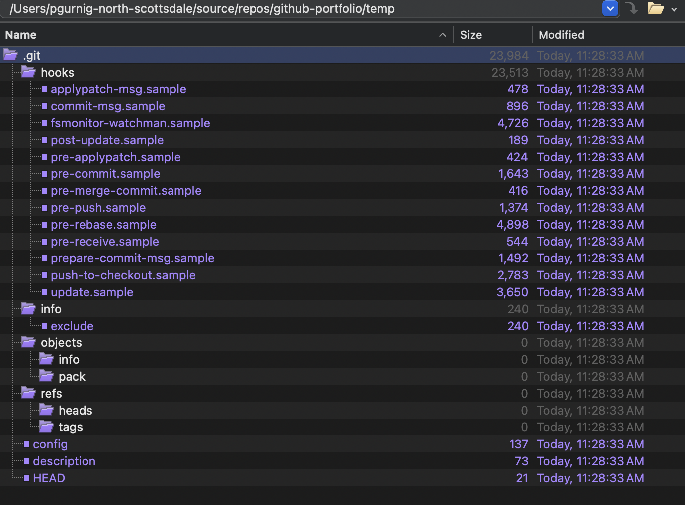

Rather than discuss what each of these elements are, we'll discuss them in the context of changes over time only as items are updated or added.

#### Understanding `echo "README" > "README.md"`
Creating a new `README.md` file has no impact on `.git`. This is simply a change to the *Working Tree*. At this juncture, the object database is unaffected. However, git does know about the change as evidenced by `git status`. It marks `README.md` as an *Untracked file* and gives us a hint for what to do next. Namely, `git add <file>`.

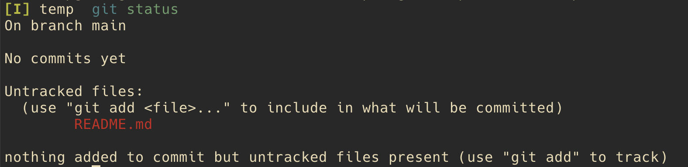

#### Understanding `git add README.md`
This is a fairly important stage in the process, and one that some git "helper" tools gloss over by combining the steps `git add <file>` and `git commit ...`. As version control tools go, the `add` step is somewhat unique to git, and a powerful tool to organize a commit.

Executing `git add README.md` impacts two items.
- An object is added to the `objects` subdirectory, e845566c06f9bf557d35e8292c37cf05d97a9769. This blob is the SHA-1 hash of metadata and the file contents.
- The `index` file is added. This file is tracking the changes we're introducing for a future commit.

> 📝 **Note**
> *We'll see this same object (e845566c06f9bf557d35e8292c37cf05d97a9769) in other repos in this series as the contents and metadata are the same.*

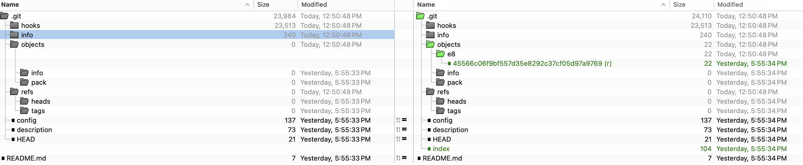

##### The e8 object
The object, `e845566c06f9bf557d35e8292c37cf05d97a9769`, is the result of applying SHA-1 to the README.md file. You can garner the same has value by using `git hash-object` on the file to understand how the hash is created. (There's a bit more to `git hash-object` than simply calculating the hash using `shasum` as it leverages metadata for its computation, specifically, `blob <size>\0<content>`.)

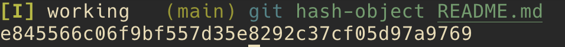

Note that Git uses the first two characters of the hash as the subdirectory to allow for an even distribution of folders. There are 256 possible combinations of the first two characters. (The math: each of the two characters can be a value 0-9, a-f, or a hex value. There are 16 values possible for each, so 16*16.)

##### The `index` file
The `index` file makes an appearance! This is an indication that we're introducing changes in our *Staging Area*. These changes are not yet committed. Think of the staging area as a place to organize the files you plan to commit. You can add files one at a time to organize your commit at a granular level (rather than just invoking `git add .` from the root folder in the project).

You can't `cat` the `.git/index` file obtaining any sensible results. However, you can run the following to understand the contents:

```bash
git ls-files --stage
```
So, we have our blob (`.git/objects` and an indication of what we want to commit `index`). Let's go ahead and commit these changes.

#### Understanding `git commit -m "Initial commit"`
With `git commit`, we see even more changes to the Object Database.

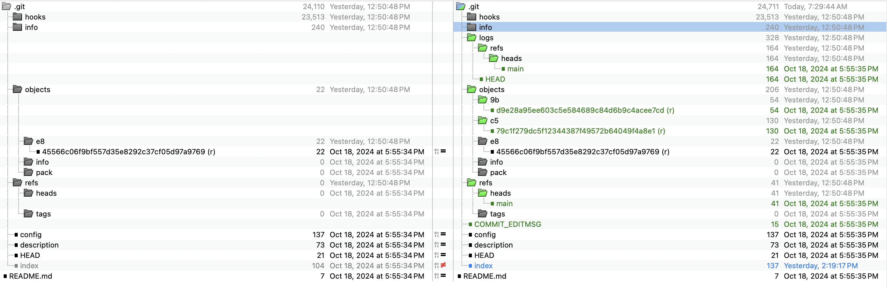

- Our `e8` object remains intact, but we have two new objects beginning with `9b` and `c5`.
- `refs/heads` now has a file `main`.
- There's a new file, `COMMIT_EDITMSG`.
- The `index` file that was introduced in the prior step (`git add <filename>`) has changed.
- There's a new `logs` directory with several additions.

Let's look at each of these in turn.

##### `.git/objects` changes
Two new objects appear in the objects folder:
```bash
- 9bd9e28a95ee603c5e584689c84d6b9c4acee7cd
- c579c1f279dc5f12344387f49572b64049f4a8e1
```

We've covered the blob above, so won't consider that now.

We can use a shell utility, `git-discover-object-types.sh`, to iterate over the objects and discover their types. (*The shell script, `git-discover-object-types.sh`, is available in this repo: https://github.com/pgurnig/github-lab.*)

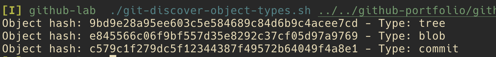

We have two new types: a tree and a commit. Let's review each.

###### The tree object - new object
When we `git cat-file -p <hash>` on the tree, the output shows a reference to the prior `e84556` hash, which is our `README.md` file.

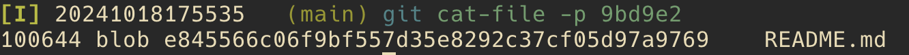

###### The commit object - new object
When we `git cat-file -p <hash>` on the commit, the output shows the commit message with a reference to the hash of the root tree.

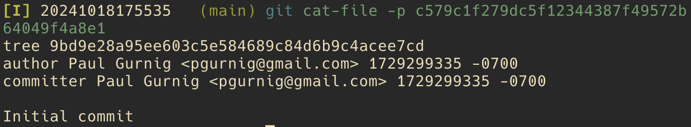

<br />
<small>

> 📝 **Additional Info**
> Beyond the scope of this topic, but interesting to understand, is the process of reverse engineering the name of the tree. In the example above, `git cat-file -p` on the hash of the tree only shows information about the README blob, not the directory name associated with the tree. <br /><br />
> The following screenshot shows how we can arrive at the name of the directory by first getting the hash of the root tree, then plugging that into `git ls-tree`. Note that the example below is based on a different repo!<br /><br />
> 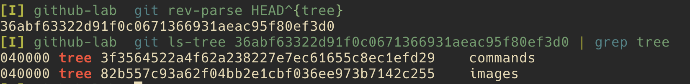

</small>

##### The new `logs/refs/heads/main` file
In his book *Building Git*, James Coglan explains the file at logs/refs/heads this way:

<small>

> These files contain a log of every time a ref — that is, a reference,
something that points to a commit, like HEAD or a branch name — changes its
value.
</small>

If we `cat` the contents of the file, we see something like this:
```
0000000000000000000000000000000000000000 c579c1f279dc5f12344387f49572b64049f4a8e1 J Doe <jdoe@example.com> 1729299335 -0700      commit (initial): Initial commit
```

Let's break down the elements:
- `0000000000000000000000000000000000000000`: This is the previous commit. All zeroes means that there was no previous commit.
- `c579c1f279dc5f12344387f49572b64049f4a8e1`: This commit that we saw above.
- `J Doe <jdoe@example.com>`: The name of the committer.
- `1729299335`: The UNIX timestamp.
- `commit (initial): Initial commit`: The initial commit message.


##### Introducing `COMMIT_EDITMSG`
The file, COMMIT_EDITMSG, represents file storage for your commit message. It's helpful to consider two different methods of submitting a commit.
1. `git commit -m "My commit message"`
2. `git commit`

In the first case, no editor is invoked, but the `-m` represents the switch for "My commit message" which is saved to COMMIT_EDITMSG. If you were to subsequently `git commit --amend`, COMMIT_EDITMSG would contain the text "My commit message" and use it as part of default text.

#### Understanding `echo "Lorem ipsum" > "example.txt"`
The addition of `example.txt` isn't unlike the addition of `README.md` earlier in that they both simply become files in the *Working Tree*.

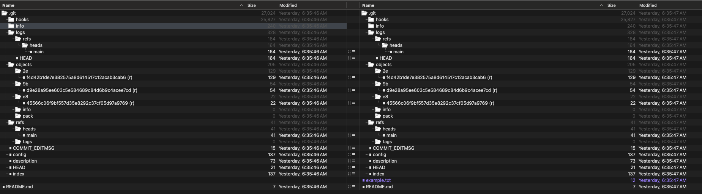

#### Understanding `git add example.txt`
As we continue with a similar path to our first commit, we can see changes to `.git/objects` and the `index` file.

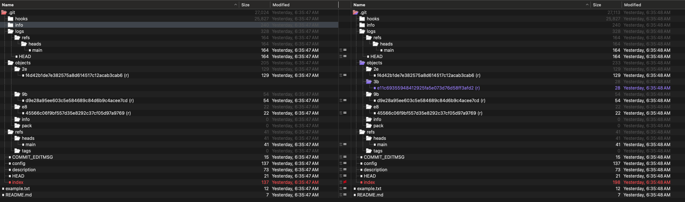

We can understand the contents of the index file by using `git ls-files --stage`.
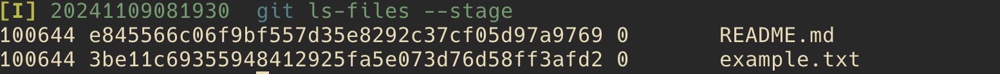

Once we perform our `git reset --hard HEAD~1`, we'll note the changes to `index`.

#### Understanding `git commit -m "Add example.txt"`
As we can see in the following screenshot, we have a number of new items in the *Object Database*.

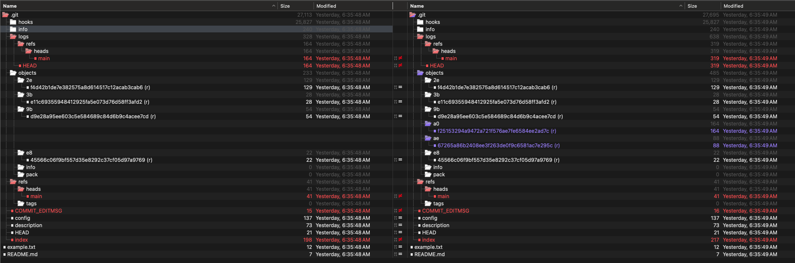

We have two new objects in the *Object Database*.
- a0f25153294a9472a721f576ae7fe6584ee2ad7c
- ae67265a86b2408ee3f263de0f9c6581ac7e295c

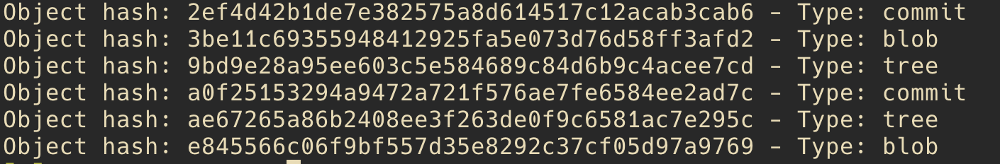

The a0 object is a commit and the ae object is a tree. Let's look at the contents of these.

```bash
git cat-file -p a0f25153294a9472a721f576ae7fe6584ee2ad7c
tree ae67265a86b2408ee3f263de0f9c6581ac7e295c
parent 2ef4d42b1de7e382575a8d614517c12acab3cab6
author J Doe <jdoe@gmail.com> 1730900149 -0700
committer J Doe <jdoe@gmail.com> 1730900149 -0700

Add example.txt
```

```bash
git cat-file -p ae67265a86b2408ee3f263de0f9c6581ac7e295c
100644 blob e845566c06f9bf557d35e8292c37cf05d97a9769    README.md
100644 blob 3be11c69355948412925fa5e073d76d58ff3afd2    example.txt
```

These changes make sense in light of our commit. We would, of course, add a commit object, but also update the tree to include a reference to the newly committed `example.txt` file.


